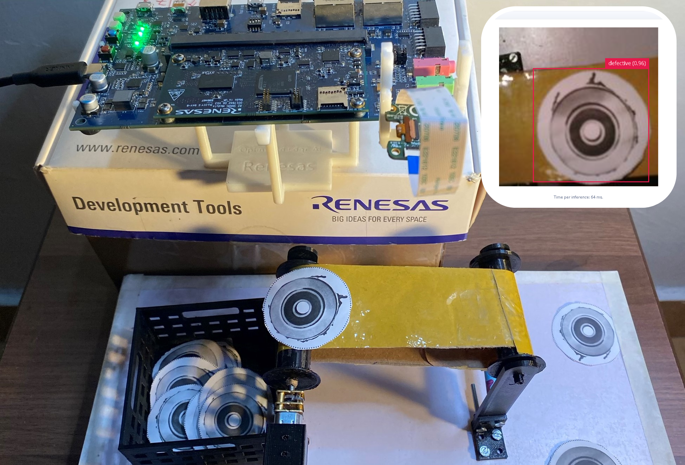

## Monitoring manufactured defects with Edge Impulse and Renesas RZ/V2L :nut_and_bolt:



### Quick start :computer:

You can find the public Edge Impulse project here [Submersible pump impeller defect detection](https://studio.edgeimpulse.com/public/198270/latest)

Documentation [link](https://docs.edgeimpulse.com/experts/prototype-and-concept-projects/renesas-rzv2l-product-quality-inspection) for the project.

Ensure you have a recent version of Python then install the Edge-Impulse Linux Python SDK : 
```
 pip3 install edge_impulse_linux -i https://pypi.python.org/simple
```

Next, install Flask which is required to run the application.
```
pip3 install flask
```

Clone the repository to your target board
```
git clone https://github.com/SolomonGithu/manufacturing_process_monitoring-submersible-pump-impeller-_with_Edge_Impulse.git
```

Navigate to the repository
```
cd manufacturing_process_monitoring-submersible-pump-impeller-_with_Edge_Impulse
```
Start the application by running the following command while in the root directory of this repo:
```
python3 app.py
```

Alternatively, this Flask application has also been built as an executable for aarch64 (or amd64) Linux platforms using PyInstaller. This executable is in the ```dist``` folder. Run the commands below to start the executable:
```
cd dist && \ 
chmod u+x app && \
./app
```


### Rebuilding the executable :hammer:

If you want to update the application and rebuild the executable ensure [PyInstaller](https://pyinstaller.org/en/stable/) is installed. 

Since the RZ/V2L is of the AARCH64 platform, we need to ensure this is the target for the built executable. By default, the PyInstaller's bootloaders architecture defaults to the installed machine’s platform. If you want to cross compile on a host computer you can do it by [building the bootloader](https://pyinstaller.org/en/stable/bootloader-building.html) for AARCH64.

Ensure that a terminal is open in the parent directory of this repository and build the application with the command:
```
pyinstaller -w -F --add-data "templates:templates" --add-data "static:static" --add-data "modelfile:modelfile" app.py
```

If you see some warnings when looking for dynamic libraries in the build process, first run the command ```sudo ldconfig``` and build the application again.

Lastly start the application with the command :
```
cd dist && ./app
```

### Renesas RZ/V2L and Google Coral camera holder - 3D models :arrow_down:


A great fit for supporting the Renesas RZ/V2L Evaluation Board Kit components! The camera can be mounted upright or facing downwards through the provided slots.

The Renesas RZ/V2L board is placed on the base support model. The model, base support raiser, is placed below the base support to increase the height of the Renesas board and camera.

The 3D models are available to be downloaded on [printables.com](https://www.printables.com/model/491830-renesas-rzv2l-and-google-coral-camera-holder)

